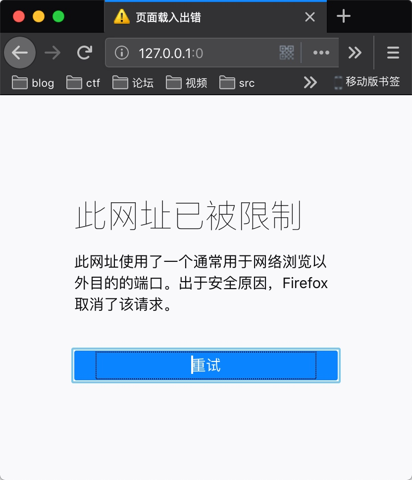

#   Bottle 
> hint1 */3 */10
> hint2 firefox 

## payload
```
http://bottle.2018.hctf.io/path?path=http://bottle.2018.hctf.io:0/%0a%0d%0a%0d<script>alert `1` </script>`
```
一个clrf头注入,当端口小与80时猜测firefox不会跳转


利用这个特性使其加载js达到xss
## 绕csp
`hint1 :  */3 */10`
这是服务器重启的两个时间
bottle每次重启时响应头顺序可能会随机变化
人为干预了下这变化
`*/3` 为csp在上面location在下面的服务重启时间
`*/10` 为csp在下面location在上面的服务重启时间
需要在指定时间内上传`payload`才能拿flag


